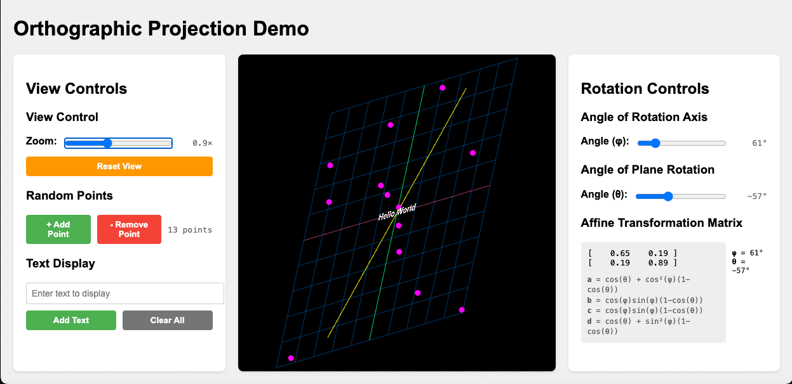

# Orthographic Projection Demo



This web application demonstrates the transformation of points and text laying in a 2D plane that is subject to 3D rotation of that plane about a arbitrary vector that lies in that plane. An orthographic projection is used so the Rodrigues' rotation transformation can be applied. The app allows interactive manipulation of the in-plane axis of rotation and the angle of rotation of that plane about that axis

## Features

- Adjustable axis of rotation direction angle (0° to 360°)
- Interactive plane rotation angle control (-180° to +180°)
- Zoom control for scaling the view (0.2× to 2.0×)
- Real-time visualization of the rotation
- Orthographic projection for true 2D visualization
- Random placement of points in the plane
- Text input field for text at plane origin.

## Installation

1. Make sure you have [Node.js](https://nodejs.org/) installed on your system
2. Clone this repository
3. Install dependencies:
   ```bash
   npm install
   ```

## Running the Application

1. Start the server:
   ```bash
   npm start
   ```
2. Open your browser and navigate to `http://localhost:3000`

## How to Use

1. **Coordinate Axes**: The scene is defined as a grey wireframe
grid in the X-Y plane, with origin at window center. The +X axis is shown in red, and the +Y axis in green.

2. **Angle of Rotation Axis**: The axis of rotation is shown as a yellow line that lies in the X-Y axis. The angle of this axis ranges from 0° at the X-axis and 90° at the Y-axis. Adjust the angle slider to change the direction of the axis of rotation from (0° to 360°)

3. **Angle of Plane Rotation**: The rotation angle slider rotates the 2-D grid about the axis of rotation with values ranging from (-180° to +180°)
   - Positive angles rotate counterclockwise around the axis
   - Negative angles rotate clockwise around the axis

4. **Zoom**: Use the zoom factor slider to scale the view (0.2× to 2.0×)
   - Scales the entire scene uniformly about the origin
   - Maintains the relative positions and proportions of all elements
   - Useful for examining details or getting a broader view

5. **Random Points**: Use the "add point" and "remove point" buttons to manage 2-D points placed randomly on the grid.

6. **Text field**: Enter a text string (default is "Hello World") to be placed at grid origin.

7. **Affine Transformation Display**: The equivalent 2D affine transformation (resulting from the 3D rotation and orthographic projection) is displayed, showing: the numerical 2x2 matrix, the current rotation angles (φ and θ), and the equations defining the matrix elements.

## Technical Details

*   Uses **Three.js** for 3D rendering and an orthographic camera for the 2D projection.
*   **Rodrigues' Rotation Formula** is implemented in `applyRodriguesRotation` function in `public/js/rotation.js` to calculate the rotated positions of vertices and points.
*   Points and text added *after* a rotation are correctly placed onto the transformed plane by applying the current rotation to their initial position.
*   The 2D affine transformation matrix is derived mathematically from the Rodrigues formula and the orthographic projection.
*   A simple **Node.js/Express** server (`server.js`) serves the static HTML, CSS, and JavaScript files. 

## Contributions
Kudos to Cursor 1.96.2, NodeJS v23.6.0, MacOS 15.4.1, and Gemini 2.5-pro - the tools that allowed me create this little demo app in less than 3 hours in 100% hands-off fashion.